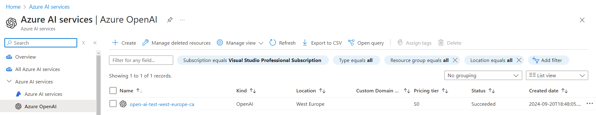
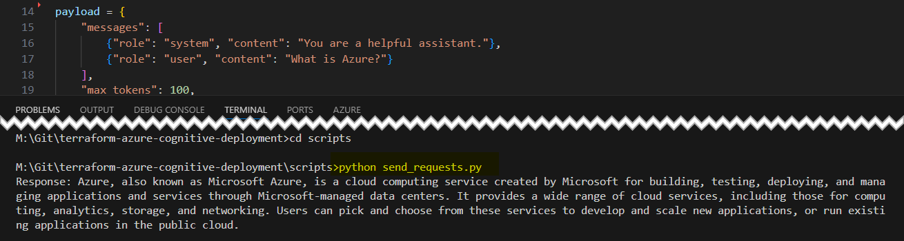
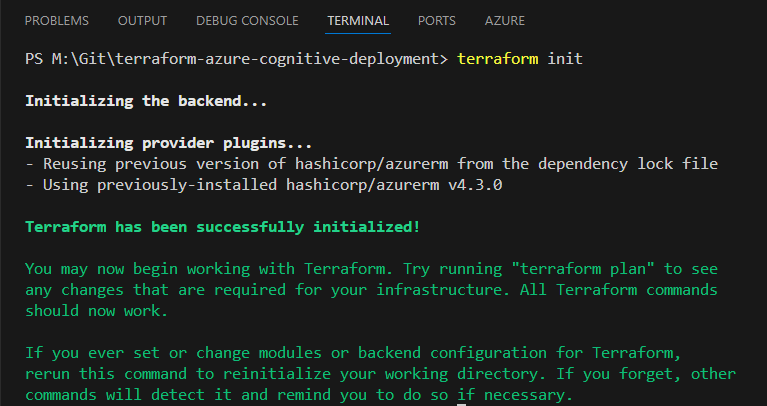
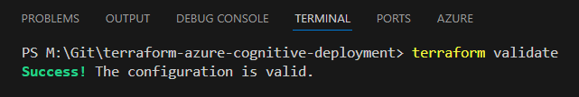
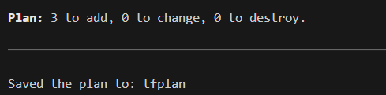
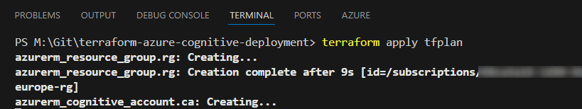
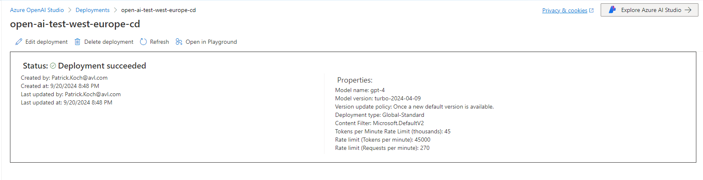

# Contains a Terraform configuration to provision a cognitive deployment on Azure

This Terraform configuration is capable of deploying an Azure Open AI Service and a gpt-4 model.
After the deployment, it is possible to conduct a chat by using a Python script with the generated API_Key and a public Endpoint.

<p align="left">
  
</p>

<p align="left">
  
</p>

# Prepare the terraform.tfvars file

Create a new file inside the checked out directory of this repository, named "terraform.tfvars". The content of it can be seen in the code snippet below - there are 12 values to assign to predefined variables:

```hcl
subscription_id = "<add your subscription id here>"
resource_group_name = "open-ai-test-west-europe-rg"
resource_group_location = "West Europe"
cognitive_account_name = "open-ai-test-west-europe-ca"
cognitive_account_kind = "OpenAI"
cognitive_account_sku_name = "S0"
cognitive_deployment_name = "open-ai-test-west-europe-cd"
cognitive_deployment_model_format = "OpenAI"
cognitive_deployment_model_name = "gpt-4"
cognitive_deployment_model_version = "turbo-2024-04-09"
cognitive_deployment_sku_name = "GlobalStandard"
cognitive_deployment_sku_capacity = 45
```

The only value to determine for your personal deployment is the "subscription_id" of your Azure subscription.
You can run the following command to find the "subscription_id":

```azurecli
az account show
```

Add the subscription id as value in the first line in the "terraform.tfvars" file and save it.
The "terraform.tfvars" has to be located side by side to the "main.tf", "terraform.tf" and the "variables.tf" files.

# Deploy the resources using Terraform

Start a new terminal, change the directory of the checked out directory of the repository.

After that, conduct the following four Terraform commands:

## Terraform init

```hcl
terraform init
```

<p align="left">
  
</p>

## Terraform validate

```hcl
terraform validate
```

<p align="left">
  
</p>

## Terraform plan

```hcl
terraform plan -out tfplan
```

<p align="left">
  
</p>

## Terraform apply

```hcl
terraform apply tfplan
```

<p align="left">
  
</p>

This finally deploys the Azure AI Service named "open-ai-test-west-europe-ca":

<p align="left">
  
</p>

and the "gpt-4" deployment "open-ai-test-west-europe-cd":

<p align="left">
  
</p>